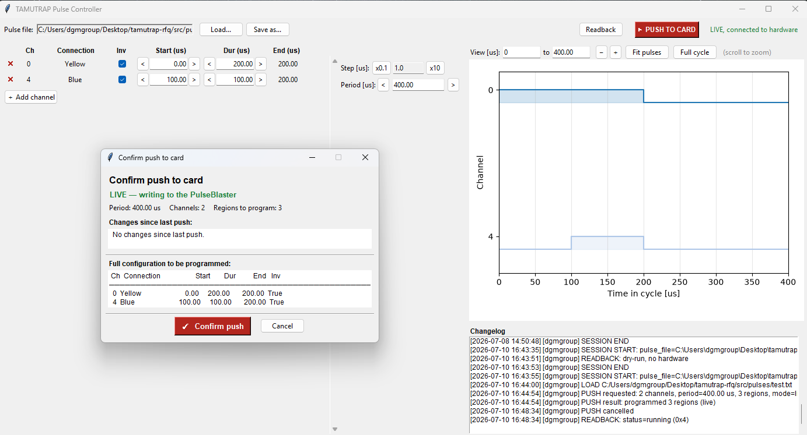
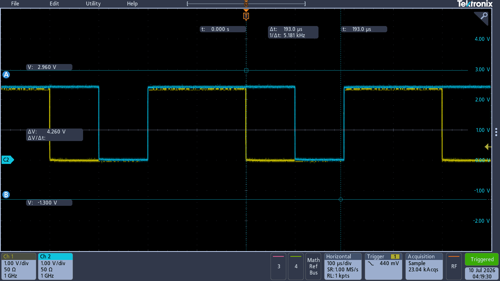

# TAMUTRAP Pulse Timing Controller

[](https://doi.org/10.5281/zenodo.21477204)

This is the control system for the pulsed timing chain of **TAMUTRAP**,
Texas A&M University's cylindrical Penning-trap experiment at the Cyclotron
Institute. TAMUTRAP measures β-ν angular correlations in precision beta decay,
searching for physics beyond the Standard Model, and doing that means catching
ions at exactly the right microsecond.

Measurement is a periodic cycle, bunching the beam out of the RFQ cooler-buncher,
gating it into the trap through the injection end caps, letting it settle, applying
magnetron and cyclotron excitation to prepare it, then opening the extraction end
caps and triggering the DAQ. Every one of these steps is a digital pulse on a
specific channel at a specific time, and the whole cycle can be hundreds of
milliseconds long with features only microseconds wide. All of it is driven by
a **SpinCore PulseBlaster**, and this project is what talks to it.

It's a rewrite of an older Kivy-based P2S pulse software, restructured so
the parts that have to be *correct* (the pulse math) are completely separate
from the parts that are *optional* (a real card) and the parts that are just
UI. Its sister project, [LSTAR MPOD Control](https://github.com/almondshawarma/LSTAR-MPOD-control),
runs the electrostatic beamline that shapes and cleans the beam upstream, and the two share
the same design conventions (layered code, dry-run everywhere, an append-only
changelog, and now an EPICS IOC).

This repo is both the thing that runs the hardware and a writeup of how it's built.

## What it actually does

You can describe timing the way a physicist thinks about it, "this channel pulses
from t to t+Δ", and the tool turns that into what a PulseBlaster actually needs,
a flat list of **regions**, each a constant output state held for a fixed
duration, for each hardware instruction.

```
   pulse table (per channel)              timing regions                 hardware
  CH0 RFQ         start=0   dur=14.25
  CH4 Extr_EndCap start=... dur=300    ──>  [state, duration] × N   ──>  PulseBlaster
  CH11 Cyc_Excite start=... dur=20000       (one instruction each)       stop → program → start
```

Every pulse edge across every channel becomes a cut point on the timeline.
Between two adjacent cuts the combined output is constant, so each region maps to
exactly one instruction, with its state packed as `sum(bit_c × 2**channel_c)`.
That transformation, `create_regions()` in [`core.py`](src/core.py), is the piece the
test suite pins.

## Screenshots

The tkinter app live on hardware, with a push confirmation open:



And the payoff: two channels of the programmed cycle on a scope, straight off
the PulseBlaster!



## Why it's organized the way it is

Everything is built around modularity. There is only one place that has to be
correct, and it knows nothing about hardware or UI.

- [`core.py`](src/core.py): The data model, `PulseConfig`, file load/save, and
  the region/state math. Pure Python/pandas; no GUI import, no hardware import.
  `PulseConfig` re-validates after *every* mutation, so it can never be left in
  a half-applied state, as a bad edit raises `PulseFormatError` and nothing
  changes. This is the only file that has to be "correct" in the trap-timing
  sense, and it's the only file the tests really care about.
- [`timing_card.py`](src/timing_card.py): Wraps the SpinCore driver, so if
  `spinapi` can't be imported or its DLL silently fails to load, every method
  becomes a printed no-op instead of raising. The rest of the program runs
  identically with or without a card attached; `connect_or_dry_run()` makes that
  decision once at startup.
- [`changelog.py`](src/changelog.py): An append-only audit trail, where plain
  `[timestamp] [user] message` lines written next to the pulse file, same format
  as the LSTAR MPOD tools, so `cat`/`grep` work quite easily.
- [`gui_tk.py`](src/gui_tk.py): The tkinter app, imports from `core` and
  `timing_card`, instead of the other way around.
- [`ioc/rfq_ioc.py`](ioc/timing_ioc.py): An EPICS IOC (see below) that imports the
  *same* `core` and `timing_card` and thus re-implements none of their logic.

**There is one core, but two front ends.** The GUI and the IOC are both just clients
of `core.py`. Neither duplicates the pulse math or the safety/validation rules,
instead they both go through `PulseConfig`, so adding a front end doesn't necessitate
forking the code.

**Editing doesn't touch the card.** In both front ends, an edit only updates the
in-memory model and the diagram, but nothing is written to the PulseBlaster until an
explicit "push". An `● unpushed edits` marker (GUI) / `UnpushedEdits` PV (IOC)
shows when what's in memory differs from what's programmed. A push then does a proper
stop → program → start so the new timing actually runs, and it warns first if
any region is shorter than the card's minimum instruction length (5 core-clock
cycles, 0.05 µs at 100 MHz). Those can't be represented, and would make the real
output silently disagree with the diagram.

**The GUI degrades gracefully.** On startup it loads the example cycle, tries to
connect to a real board, and falls back to dry-run with a popup if none is found.
You can open the timing diagram, edit the table, and click through a dry-run push
with zero hardware dependencies, which isuseful for demonstrating the tool (and for
anyone reviewing the design without lab access). The diagram is built for the real
problem: injection/extraction pulses are microsecond-scale slivers inside a
hundred-millisecond cycle, so it has **Fit pulses**, **Full cycle**, and
scroll-to-zoom-about-the-cursor.

**Readback is honest about what the hardware can't do.** The PulseBlaster's
instruction memory is *write-only*, so unfortunately there's no way to read the loaded pulse
pattern back off the chip. Instead, the **Readback** button reports only what's
actually a hardware read, the board's run state (running / stopped / waiting /
reset), confirming the card is powered, responding, and executing. "What
pattern is loaded" is only ever this app's record of the last thing it pushed,
labeled that way everywhere rather than pretending the silicon was queried.

**Every hardware-affecting action is logged.** Session start/end, edits, loads,
saves, and pushes all append to the changelog next to the pulse file, leaving a basic
audit trail for a system writing real timing to a real trap.

## Driving it from EPICS

[`ioc/timing_ioc.py`](ioc/timing_ioc.py) is a thin EPICS IOC built on
[`caproto`](https://caproto.github.io/caproto/). It maps Channel Access Process
Variables (PVs) onto the existing `core.py` model and `timing_card.py` driver,
re-implementing no pulse math. The point is decoupling, so once every knob and
readout has a global name and a network address, any client (a script, an
archiver, a Phoebus screen, etc.) can drive the timing without importing our 
code or knowing what a PulseBlaster is.

It's dry-run safe like everything else, so no card and no EPICS Base install
is required to bring it up:

```bash
python ioc/timing_ioc.py --list-pvs
# then, from another shell:
caput   TAMUTRAP:Timing:CH0:Active 1
caput   TAMUTRAP:Timing:CH0:Dur    5
caput   TAMUTRAP:Timing:Push       1
camonitor TAMUTRAP:Timing:RunState
```

A few design points, all forced by EPICS being what it is:

- **Static namespace.** PVs are declared at IOC start, *not* added at runtime, so
  all 24 channels are pre-declared as `CH0..CH23` with a per-channel `Active`
  flag. "Add channel" in the GUI is kind of just flipping a pre-declared slot `Active`.
- **Validate-or-reject at the PV.** An edit that fails `PulseConfig` validation
  is refused at the PV. The client sees a write error, and the old value stands.
  Safety lives server-side, so *every* client is bound by it, not just ours.
- **Software readback survives restarts.** Because the IOC is the sole writer, it
  records each push into `Loaded*` PVs and an autosave file, so "what's loaded"
  outlives a reboot. Same honesty as above: that's the commanded value, not an
  actual read of the chip.

## Installing

Dependencies are split by *role*, because the three ways this code gets deployed
don't overlap much, a headless test runner, a Windows operator workstation, and
a Linux control node each need a different slice. Use the
[`pyproject.toml`](pyproject.toml) extras:

```bash
pip install -e .            # core only: numpy + pandas (importable model, tests)
pip install -e .[gui]       # + matplotlib   → the tkinter operator app
pip install -e .[ioc]       # + caproto      → the EPICS IOC
pip install -e .[dev]       # + pytest, pyepics
pip install -e .[gui,dev]   # extras compose
```

The core is deliberately tiny (just numpy + pandas) so the *same* `core.py`
imports cleanly on the GUI box, a headless IOC node, and CI without dragging the
rest along. For reproducible control-node deploys there's a pinned
[`requirements-ioc.txt`](requirements-ioc.txt); prefer the extras above for
day-to-day work.

> Note: EPICS Base itself (`softIoc`/`caget`/`caput`) is a separate system-level
> install, not a pip package, but you don't need it to run the caproto IOC,
> which ships its own `caproto-get`/`caproto-put`/`caproto-monitor` clients.

## Getting started

```bash
git clone https://github.com/almondshawarma/TAMUTRAP-timing tamutrap-timing && cd tamutrap-timing
pip install -e .[gui]

# The operator app. Loads the example cycle, dry-run if no card is found.
python src/gui_tk.py
```

Resource paths (the startup pulse file, the changelog) are anchored to
`gui_tk.py`'s own directory, not the working directory, so this launches the same
whether you run it from the repo root, from `src/`, or via **Run** in an editor,
no `cd src` first.

The suite pins the exact region/state output of the shipped example cycle, so a
future refactor of the region math fails loudly instead of silently shipping
different timing to the trap:

```bash
pip install -e .[dev]
pytest
```

A failure there simply means "prove the new output is correct and re-pin the golden
master," not "just bump the number."

## The SpinCore driver (Windows and Linux)

[`src/spinapi.py`](src/spinapi.py) is SpinCore Technologies' `ctypes` wrapper
around their SpinAPI library. It's vendored here (SpinCore ships it under a
permissive zlib-style license that explicitly allows redistribution) and loads the
right library for whichever platform it's running on.

**Windows** — [`src/spinapi64.dll`](src/spinapi64.dll) is vendored too, so a fresh
checkout on the lab's Windows card machine is import-and-go, nothing else to fetch!

**Linux** — the driver *isn't* a portable binary (a `.so` compiled on one machine
won't load on a different distro/glibc), so it's built from source rather than
committed. The SpinAPI **source** is vendored in [`third_party/`](third_party/) —
so you never depend on SpinCore's site staying up — and built per-machine:

```bash
cd third_party && tar xzf SpinAPI_linux-*.tar.gz
cd SpinAPI_linux-*/ && mkdir build && cd build && cmake .. && make      # -> build/src/libspinapi.so
# point the wrapper at it (bash shown; csh: setenv LD_LIBRARY_PATH "$cwd/src:$LD_LIBRARY_PATH"):
export LD_LIBRARY_PATH="$PWD/src:$LD_LIBRARY_PATH"
```

Non-root device access on Linux also needs a one-time udev rule plus a `spincore`
group (root); see SpinCore's
[Linux instructions](https://spincore.com/support/spinapi/Linux_Help.shtml) and
[`third_party/README.md`](third_party/README.md).

On any machine without the board (or before the driver is set up), the import fails
and `timing_card.py` runs dry-run automatically, so nothing else significant changes.

## Notes

There's still some edges worth consideration

- **Minimum-width policy.** The push dialog *warns* about sub-minimum regions but
  still lets you push. Should it hard-block, or snap edges to the clock grid?
- **Core clock.** `min_instruction_us` assumes the default 100 MHz core clock, so a
  board at a different clock needs that constant and the hardware minimum to track
  it (the IOC exposes it as a PV for this exact reason).
- **Channel count vs. board.** `MAX_CHANNELS = 24` is enforced in software but not
  tied to the attached board's actual output width.
- **File-format robustness.** Loading uses fixed-width parsing that relies on
  column alignment, so a hand-mangled file could misparse. A stricter parse (or a
  format-version check) would fail louder.

## Stack

Python 3.11+ · NumPy · pandas · Tkinter + Matplotlib (GUI) ·
[`caproto`](https://caproto.github.io/caproto/) (EPICS IOC) ·
SpinCore SpinAPI (PulseBlaster driver)

## Acknowledgments

Built for the TAMUTRAP collaboration at the Texas A&M University Cyclotron
Institute, under Dr. Dan Melconian. This material is based upon work supported by
the U.S. Department of Energy, Office of Science under Awards Number DE-SC0022469 and DE-FG02-93ER40773.

## License

See [`LICENSE`](LICENSE). SpinCore's `spinapi.py`/`spinapi64.dll` are
redistributed under their own vendor license  (see the header of
[`src/spinapi.py`](src/spinapi.py).)

## Contact

Questions or issues: open a GitHub issue, or reach out at amansharma@tamu.edu.
